  

  

  

---

## 👨‍💻 About Me

I'm a full-stack developer with a passion for **AI/ML**, **systems programming**, and **building elegant applications**. I bridge the gap between heavy backend computing (using Python & Rust) and beautiful, interactive frontends (React & Flutter). 

*   🔭 **Current Focus:** Deep learning for computer vision (like *Moodify*), decentralized systems (*orinox*), and high-performance Rust utilities.
*   🧠 **Learning:** Advanced Systems Design, WebAssembly, and more advanced Rust ecosystems.
*   💬 **Ask me about:** JavaScript/TypeScript, Python, Rust, Flutter, and AI integration.

---

## 🛠️ Tech Stack & Tools

  
   
  
   
  

---

## 📌 Featured Projects

| Project | Description | Role/Stack |
| :--- | :--- | :--- |
| 💸 **[ZeroG](https://github.com/LikhinMN/ZeroG)** | AI-powered personal finance ledger with local-first storage and intelligent insights. | `Python`, `AI/ML` |
| 🎵 **[Moodify](https://github.com/LikhinMN/Moodify)** | End-to-end deep learning pipeline classifying music moods via visual Mel Spectrograms (ResNet18). | `FastAPI`, `React`, `PyTorch` |
| ⚡ **[raxios](https://github.com/LikhinMN/raxios)** | High-performance HTTP client built with Rust and N-API, with Axios compatibility. | `Rust`, `Node.js` |
| 🖼️ **[pymiro](https://github.com/LikhinMN/pymiro)** | Signal-native, declarative GUI framework for Python. | `Python` |
| 📱 **[pico](https://github.com/LikhinMN/pico)** | Featherweight, zero-boilerplate state management for Flutter. | `Dart`, `Flutter` |
| 💬 **[orinox](https://github.com/LikhinMN/orinox)** | Decentralized P2P chat platform with E2EE messaging built on libp2p. | `P2P`, `Networking` |

---

## 📊 Developer Metrics & Insights

*(These metrics are automatically regenerated daily using GitHub Actions & lowlighter/metrics)*

<table align="center">
  <tr>
    <td align="center" width="50%">
      <b>Base Metrics</b> 
      <picture>
        <source media="(prefers-color-scheme: dark)" srcset="metrics.base.svg">
        <source media="(prefers-color-scheme: light)" srcset="metrics.base.svg">
        
      </picture>
    </td>
    <td align="center" width="50%">
      <b>Languages & Activity</b> 
      <picture>
        <source media="(prefers-color-scheme: dark)" srcset="metrics.plugin.languages.svg">
        <source media="(prefers-color-scheme: light)" srcset="metrics.plugin.languages.svg">
        
      </picture>
    </td>
  </tr>
  <tr>
    <td align="center" width="50%">
      <b>Repositories & Stars</b> 
      <picture>
        <source media="(prefers-color-scheme: dark)" srcset="metrics.plugin.repositories.svg">
        <source media="(prefers-color-scheme: light)" srcset="metrics.plugin.repositories.svg">
        
      </picture>
    </td>
    <td align="center" width="50%">
      <b>Notable Contributions</b> 
      <picture>
        <source media="(prefers-color-scheme: dark)" srcset="metrics.plugin.notable.svg">
        <source media="(prefers-color-scheme: light)" srcset="metrics.plugin.notable.svg">
        
      </picture>
    </td>
  </tr>
</table>

---

## 📫 Let's Connect!

  
  

  <em>Thanks for visiting! Feel free to explore my repositories and reach out if you'd like to collaborate on an open-source project. 🤝</em>

